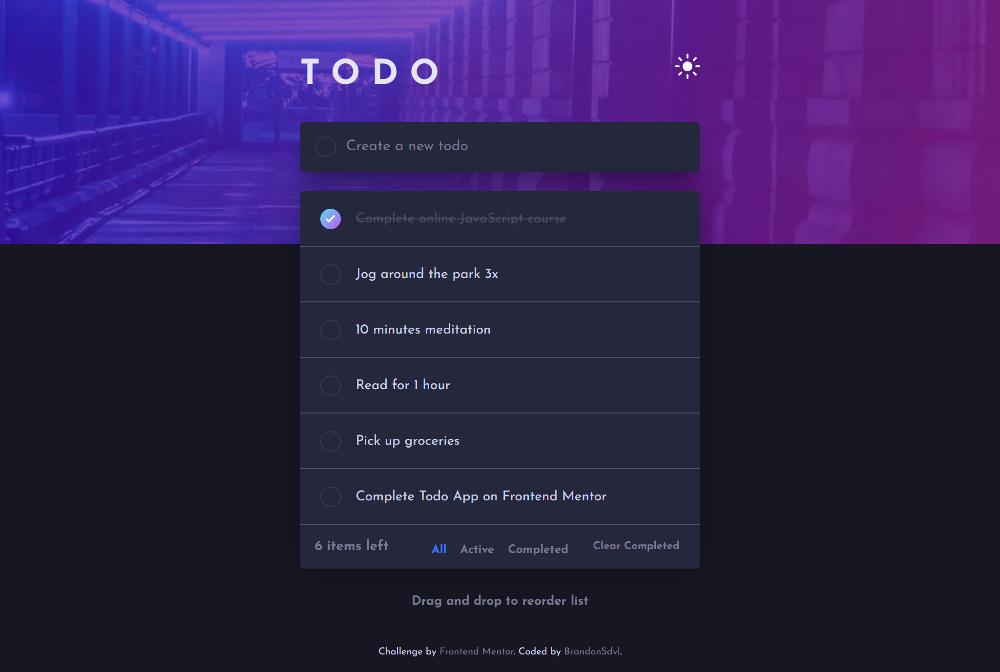

# Frontend Mentor - Todo app solution

This is a solution to the [Todo app challenge on Frontend Mentor](https://www.frontendmentor.io/challenges/todo-app-Su1_KokOW). Frontend Mentor challenges help you improve your coding skills by building realistic projects.

## Table of contents

- [Overview](#overview)
  - [The challenge](#the-challenge)
  - [Screenshot](#screenshot)
  - [Links](#links)
- [How to use](#how-to-use)
- [Built with](#built-with)
- [Author](#author)

## Overview

### The challenge

Users should be able to:

- View the optimal layout for the app depending on their device's screen size
- See hover states for all interactive elements on the page
- Add new todos to the list
- Mark todos as complete
- Delete todos from the list
- Filter by all/active/complete todos
- Clear all completed todos
- Toggle light and dark mode
- **Bonus**: Drag and drop to reorder items on the list

### Screenshot



### Links

- [Solution URL](https://www.frontendmentor.io/solutions/responsive-todo-app-with-theme-switcher-react-and-sass-FCkgS9rrV)
- [Live Site](https://todo-b.netlify.app/)

## How To Use

To clone and run this application, you'll need [Git](https://git-scm.com) and [Node.js](https://nodejs.org/en/download/) installed on your computer. From your command line:

```bash
# Clone this repository
$ git clone https://github.com/BrandonSdvl/Todo.git

# Install dependencies
$ npm install

# Run server
$ npm start
```

## Built with

- CSS variables
- Mobile-first workflow
- BEM Methodology
- [React](https://reactjs.org/) - JS library
- [Sass](https://sass-lang.com/) - CSS Preprocessor
- [react-beautiful-dnd](https://github.com/atlassian/react-beautiful-dnd) - Drag & Drop Library

## Author

- Frontend Mentor - [@BrandonSdvl](https://www.frontendmentor.io/profile/BrandonSdvl)
- Github - [@BrandonSdvl](https://github.com/BrandonSdvl)
